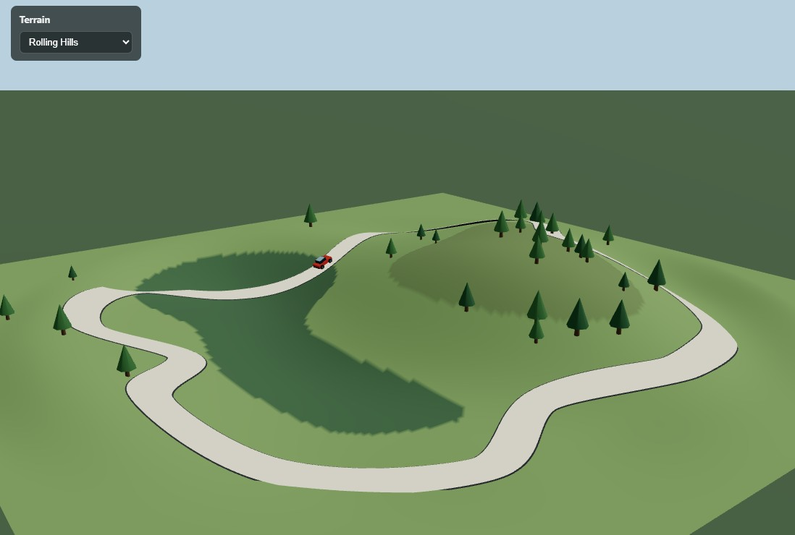

# 🚗 Terrain Drive

An interactive 3D driving scene built with **React**, **Vite**, **Three.js**, and **React Three Fiber**. A car automatically follows an irregular closed spline road through rolling hills, with switchable terrains, dynamic slope-aware tilting, and a soft gradient horizon.



---

## ✨ Features

- **Auto-driving car** that follows a closed Catmull-Rom spline through hills and dips
- **Slope-aware tilting** — the car pitches up on climbs and down on descents automatically
- **Four switchable terrains**:
  - Rolling Hills (green, gentle undulation)
  - Desert Dunes (sandy, wider swells)
  - Alpine Ridges (sharp peaks, snow caps)
  - Archipelago (islands rising from a water plane)
- **Soft horizon** — terrain edges fade into fog and a sky dome, no harsh square boundaries
- **Orbit camera** — drag to orbit, scroll to zoom
- **Vertex-colored terrain** — height-based color gradients, no textures required
- **Procedural scenery** — deterministic tree scatter that avoids the road
- **Clean architecture** — one responsibility per component, easy to extend

---

## 🖼️ Preview

| Rolling Hills | Desert Dunes |
|---|---|
|  |  |

| Alpine Ridges | Archipelago |
|---|---|
|  |  |

> Add your own screenshots to `docs/` and reference them here.

---

## 🧱 Tech Stack

| Layer | Technology |
|---|---|
| UI | React 18 |
| Bundler | Vite |
| 3D | [three](https://threejs.org/) |
| Renderer | [@react-three/fiber](https://docs.pmnd.rs/react-three-fiber) |
| Helpers | [@react-three/drei](https://github.com/pmndrs/drei) |

---

## 🚀 Getting Started

### Prerequisites

- **Node.js** 18+ and **npm** (or `pnpm` / `yarn`)
- A modern browser with WebGL2 support

### Installation

```bash
# Clone the repository
git clone https://github.com/<your-username>/terrain-drive.git
cd terrain-drive

# Install dependencies
npm install
